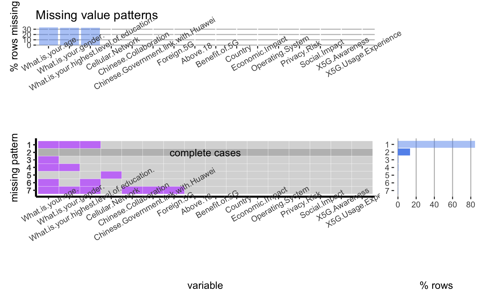

# Missing values

From the missing pattern visualization, we notice that there are a total of 7 missing patterns (including complete cases) from over 310 rows of data with 16 features. However, the majority (80%) of the missing patterns lacks data in the (age, gender, and highest level of education) categories. The rest of the missing patterns (except for the complete cases) has very minimal occurrences and could be discarded for now in the analysis. 

For this particular dataset (from a survey result), we have complete records in user opinion categories such as ‘5G awareness’, ‘5G Usage Experience’, ‘Chinese Collaboration’, various perspectives on 5G, as well as opinions on the influence placed by the Chinese government in the 5G industry. Having the above completed user opinion records, we can make correlation studies based on several intrinsic user features such as their countries, whether or not they are above 18 (inference for age), their operating system, and their cellular network. Overall, the dataset consists of adult users (>18) mainly from the U.S. or India, we have limited differences in terms of the variety of users. However, we do have many combinations regarding their opinions in the 5G network and the relationship to the Chinese party.

To complement the intrinsic user features (specific age, gender, and highest level of education), we would use additional data resources to inspect differences in opinions across age groups, gender, and education levels.